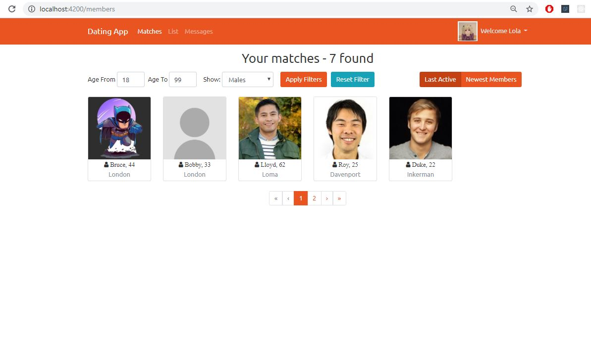
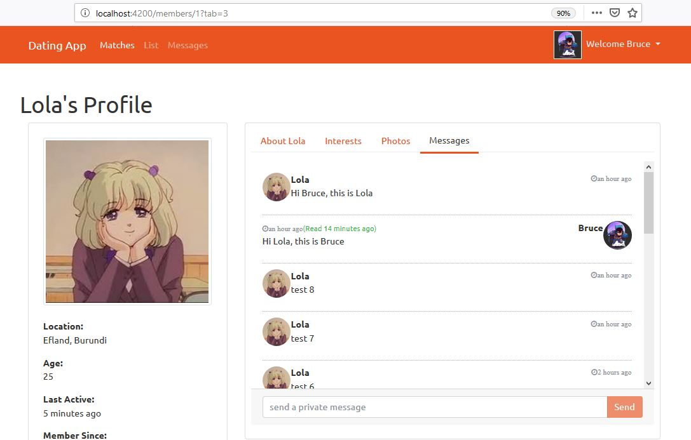
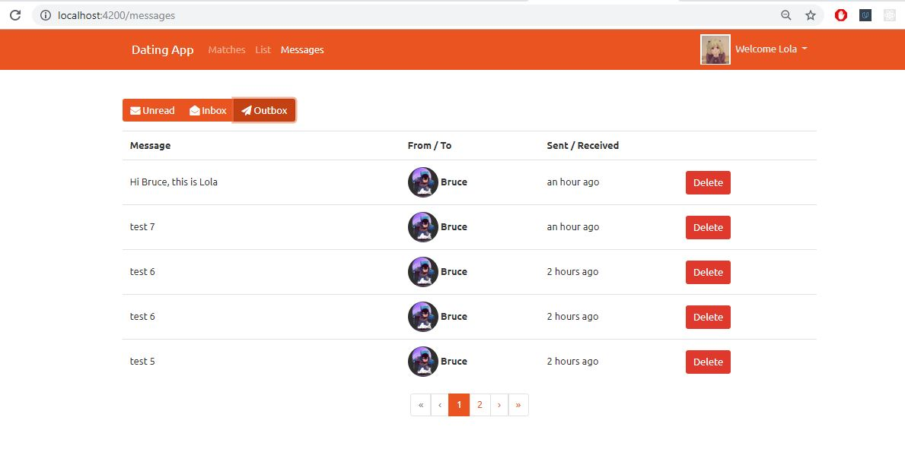

# Dating App Project

## Table of Contents

* [Description](#Description)
* [Dependencies](#Dependencies)
* [Images](#Images)

## Description

This project is named Dating App which is created based on ASP.NET Core 2.1, Angular CLI v6, Bootstrap 4. This web application allows users login or register to register and login authenticating the site using JSON Web Token. Users will be able to send Like and Private messages to each other.

Here are the things have been implemented in Dating App so far:
* Setting up the developer environment.
* Creating the ASP.NET Core Web API and the Angular app using the DotNet CLI and Angular CLI.
*  Adding a Client Side login and register function to our Angular Application
* Adding Routing to the Angular Application and securing routes.
* Using Automapper to translate DTOs to Domain Objects and vice versa.
* Building a great looking UI using Bootstrap
* Adding Photo Upload functionality as well as a cool looking gallery in Angular
* Angular Template Form and Reactive forms and validations

## Dependencies

The project is cooperated with the following frameworks and third party components:
* ASP.NET Core (v2.1), Angular (v6), Bootstrap, Entity Framework Core
* Authentication using JWT Authentication Tokens
* AlertifyJS for displaying notifications
* Cloudinary for storing images
* And more ...

## Images

* Figure 1. Login page:

* Figure 2. Register page:

* Figure 3. Members page:

* Figure 4. Member Details of the other members

* Figure 5. Message tab in Member Details where members can send message to each other.

* Figure 6. Messages page where members recieve and check unread messages.

